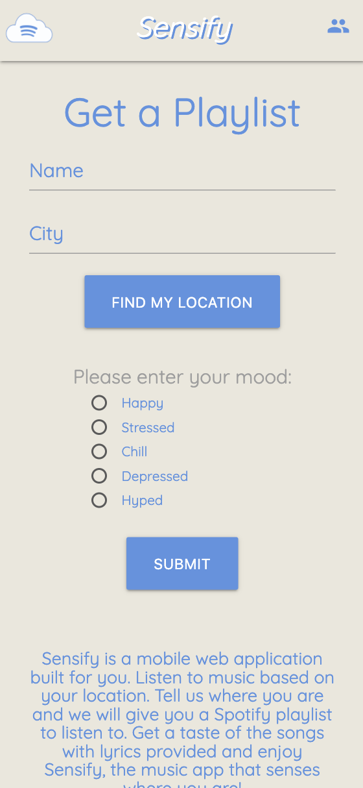
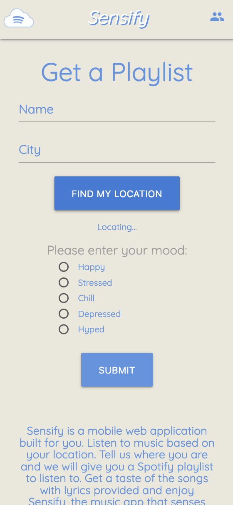
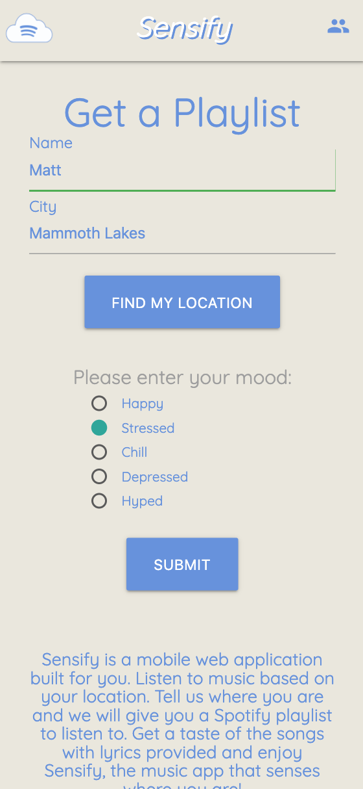
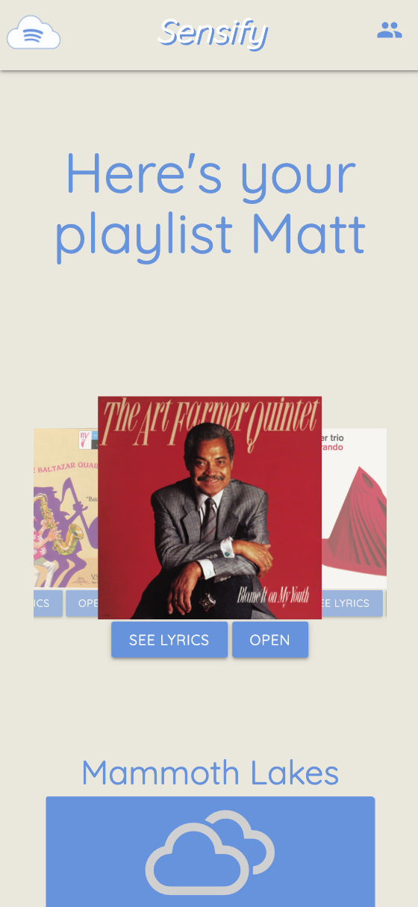
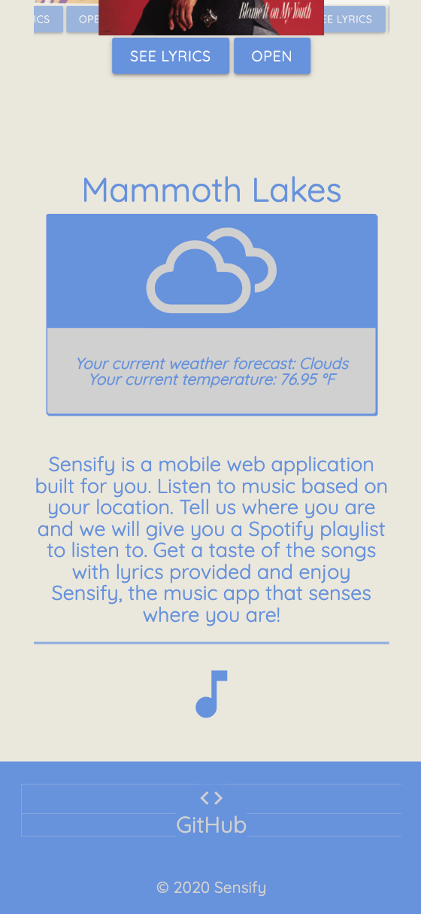
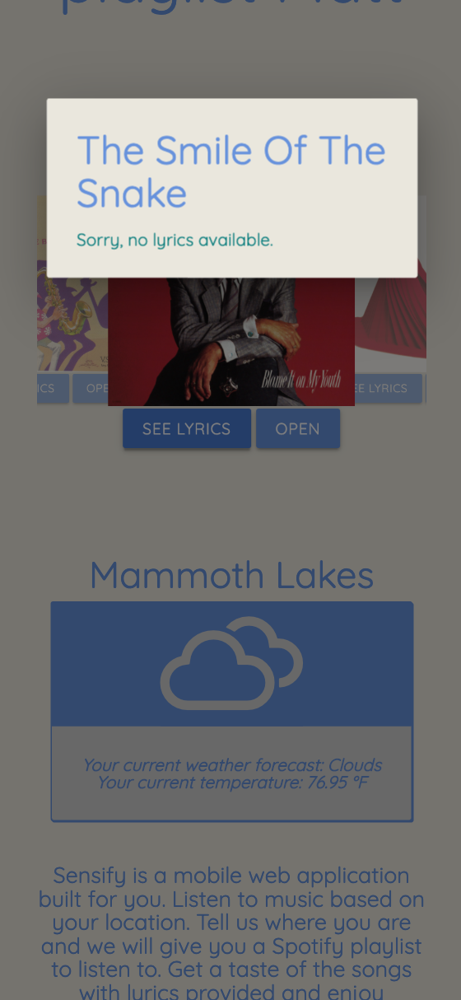
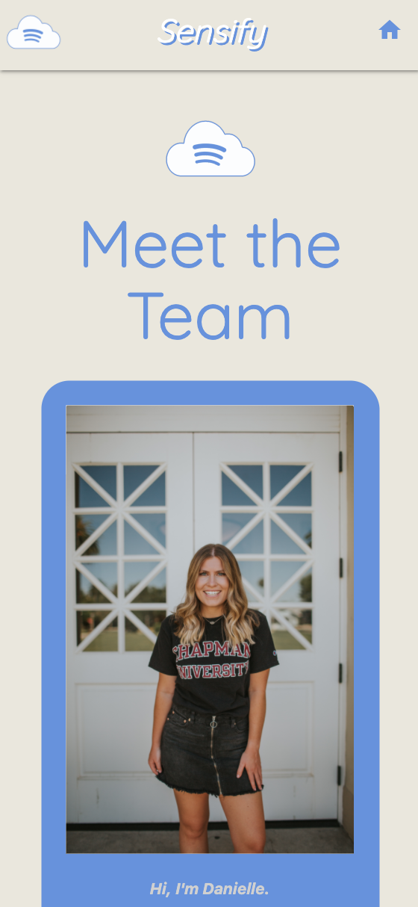
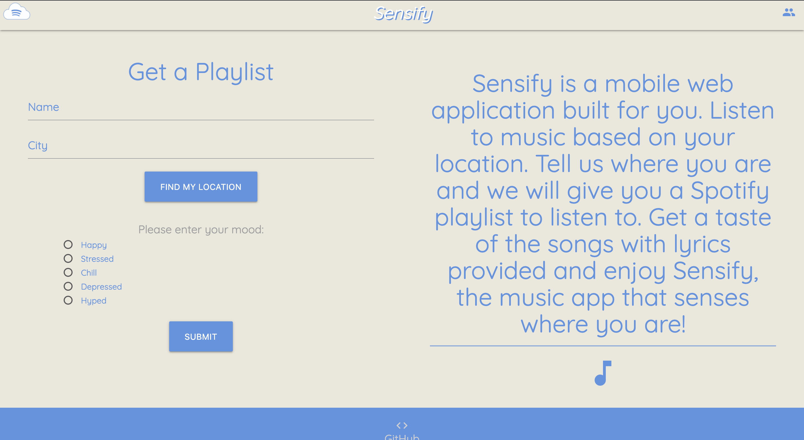
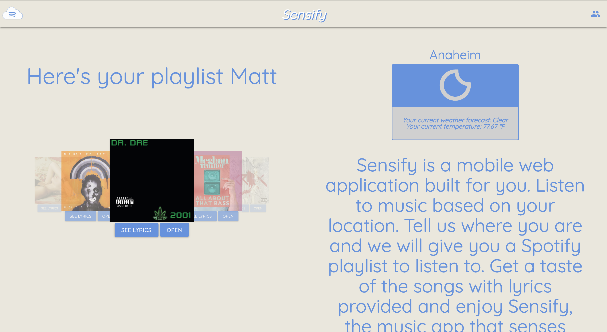

# Sensify: The Weather Playlist Recommender

### About 

Sensify is an application that uses the weather and your mood to recommend a Spotify playlist. It runs in the browser and uses the OpenWeatherMap API, the Spotify Web API, and the lyricsovh API.

Simply input your name, your city, and select one of our chosen moods, and a playlist will be recommended to you. You can also allow the application to use your current location to fill in the city input for you.

You will be recommended ten songs depending on your input, each of which may have lyrics available to read through. Open up the song on Spotify and listen along.

View the application here at https://daniellehillman.github.io/Sensify/

### Images 

* The initial start of Sensify on a mobile device

* Finding the user's location

All user input fields filled out

After clicking "Submit", a Spotify playlist is shown

The weather based on location is also displayed

Since this is a jazz song, there are no lyrics

This is another song with lyrics displayed

The about page, introducing the team behind Sensify

The rest of the team, displayed on the desktop version

The start of Sensify on the desktop version

Sensify with a playlist recommended and the user's weather data shown

### How to use Sensify
It may not run in browser due to the authorization process of the Spotify Web API.

Using the Spotify Web API requires an OAuth token, one that expires every hour. In order to receive a new token, a call on the terminal is required. First, the application has to be registered with Spotify, in which a client ID and a client secret is given. Using the client ID, the client secret, and any redirect URI, we simply run a curl command in the terminal that gives us an access token and a refresh token. When the access token expires, we use the refresh token in another curl command to get a new access token.

If the code is downloaded, do the following to run Sensify in the browser:

* Visit https://developer.spotify.com/dashboard/login to create a Spotify developers account if one isn't already created. You'll need to register an app to be given a client ID and client secret. Be sure to save those.

* Choose a redirect URI just in case, any site will do. For example: https://developer.spotify.com

* Run your redirect URI through a urlencoder, save the encoded uri

* Search the following in your address bar:
> https://account.spotify.com/authorize?client_id={your client ID}&scopes={any API scopes desired}&response_type=code&redirect_uri={encoded redirect uri}

* It will then update the address bar, look for an authorization code following the word "code=". That is your authorization code needed to get an access token.

* To get a token, run the following in your terminal:
> curl -H "Authorization: Basic {base64encoded(clientid:clientsecret)}" -d grant_type=authorization_code -d code={authorization code} -d redirect_uri={encoded redirect uri} https://account.spotify.com/api/token

* It should give you an output similar to this:
> {"access_token":"{access token}","token_type":"Bearer","expires_in":3600,"refresh_token":"{refresh token}","scope":""}

* Save both the access token and the refresh token.

* Use the access token in your code for making a request to the Spotify API. After an hour, the access token will expire. Then, run the following in your terminal:
> curl -H "Authorization: Basic {base64encoded(clientid:clientsecret)}" -d grant_type=refresh_token -d refresh_token={refresh token} https://accounts.spotify.com/api/token

* You will then be given a new access token. Copy it and use it in your code. Repeat whenever a new token is required.